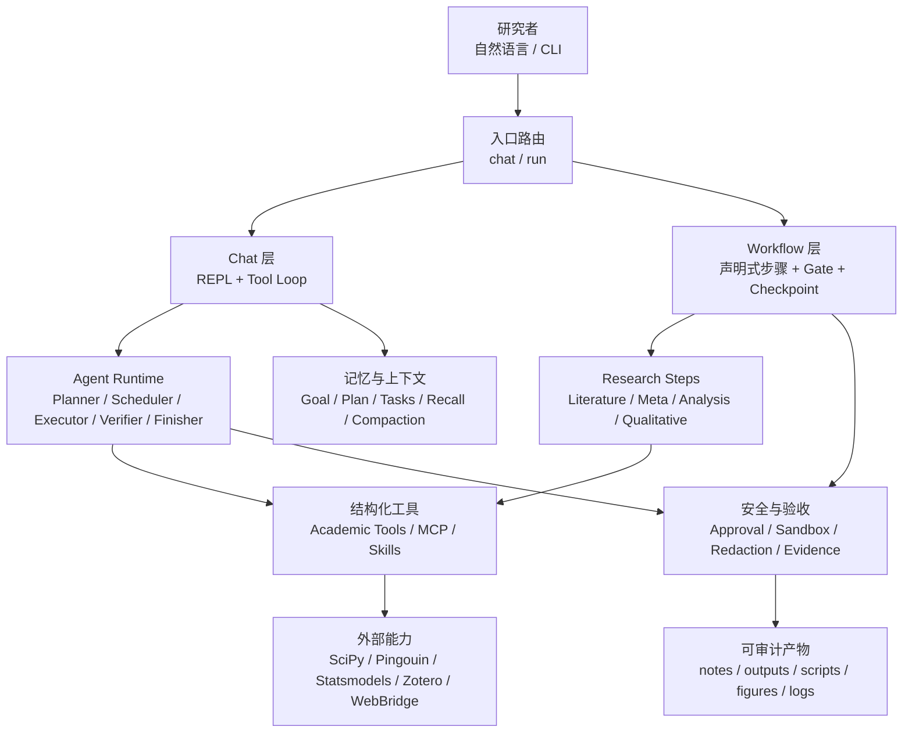

> **v0.23 legacy documentation.** 本页保留用于复现 PsyClaw v0.23.0；v0.24.0 的当前范围、接口与验收标准请以 开工纪要.md、架构蓝图.md 和 评测框架.md 为准。

# PsyClaw 开发地图

**快照：** 2026-08-12  
**基线：** v0.22.0  
**当前提交：** `e5f30f4`  
**远端：** `origin/master`  
**自动化验证：** `2368 passed, 12 skipped`

这张地图记录 PsyClaw 从 v0.22 到当前版本的开发路径、系统能力、关键决策和剩余验证工作。时间线回答“怎么走到这里”，架构区回答“现在是什么”，验证区回答“哪些已经被证实”。

## 一、路线总览


## 二、时间线

### v0.22：面向用户的入口重做

- 统一“灵智龙虾”品牌、启动页和官网首屏。
- 增加 macOS/Linux、Windows、Release、源码 ZIP 和离线包入口。
- 清理仓库，把开发脚手架和审计材料归入 `dev/`。
- 收敛 README、安装脚本、命令清单和白皮书中的版本与命令契约。

**阶段产出：** 项目从“开发中的研究工具”转向“可安装、可理解的公开产品”。

### v0.23：从发现 Skill 到 Skill 平台

- 引入 Skill Registry：检索、分类、来源、哈希、证据等级、启停和重名副本审计。
- 增加 core + 领域 Skill Pack，并支持受约束的稀疏安装、更新和启停。
- 增加 Agent 原生学术工具：资料编译、Claim-Evidence、Skill 蒸馏、交接、图件编排和 DOCX 检查。
- 宿主生态只读发现 Claude Code、Codex、cc-switch 的 Skill、插件和 MCP；项目 MCP 默认不执行。
- 强化 DOCX 导出契约、OOXML 检查、三线表 fixture 和视觉验证脚本。
- 补齐 Windows/macOS 离线包和 PowerShell/CMD 执行链。

**阶段产出：** PsyClaw 的核心价值从“命令集合”扩展为“研究编排 + Skill/MCP 扩展平台”。

### 7c0a850：Agent 规划和执行分离

```text
Planner → Scheduler → Executor / Forks → Verifier → Finisher
```

- Planner 只输出 JSON DAG，不执行工具。
- Scheduler 使用有界并发、关键路径和 `owned_paths` 控制并行写入。
- Executor 以独立任务上下文执行，Verifier 只信真实工具回执和必需产物。
- 副作用尝试过后不自动重放，避免网络超时造成重复提交。

**解决的问题：** 模型把“计划”“已经执行”和“最终总结”混在同一轮，导致假完成、重复副作用和不可审计。

### 3655669：Agent 与分析流程加固

- 加固 Windows Agent 执行、PowerShell/CMD 方言分派、多行脚本处理和 `which` 适配。
- 增加 Agent 工具调用契约、MCP 代理、能力探测和统计流程的真实产物约束。
- 分析流程补齐数据画像、质量标记、脚本生成、统计后端委托和流程验收。
- 普通副作用保持 `approval=auto`；凭据、递归删除、表达式执行等高风险动作始终确认。
- Shell 子进程不继承 Provider/MCP Token，回传前脱敏。

**解决的问题：** “模型说要做”不等于“系统真的做了”，尤其是在 Windows、MCP 和统计脚本场景中。

### e5f30f4：Provider 显式配置与上下文工程

- 无 provider、缺 API key、OpenCode 不可用时显式失败，提示 `psyclaw config`。
- `mock` 仅作为显式测试 provider，不再是默认值或静默 fallback。
- REPL 的 `/model`、`/provider`、`/config` 配置失败时保留当前会话，不让终端崩溃。
- Agent 角色提示不再每轮复制完整 `PSYCLAW.md` 与 `rigor.md`，改为角色契约 + 短共享硬约束，详细规则按需读取。
- 新增三份对话教程和 provider/prompt 回归测试。

**解决的问题：** 隐式 mock 会掩盖真实配置错误；过长且重复的系统提示会稀释注意力、增加上下文成本。

## 三、当前系统地图



### 1. 入口层

| 入口 | 定位 | 当前状态 |
|---|---|---|
| `chat` | 研究者与 Agent 协作推进 | 主入口，默认 agent 模式开启 |
| `run <type>` | 按步骤执行文献、元分析、实证、质性流程 | 主流程入口，支持 gate、checkpoint、resume |
| `run` | 根据项目状态自动继续下一步 | 自动编排入口 |
| `agent` / `loop` / `auto` | 兼容或高级入口 | 保留，但不作为新用户的主要心智模型 |

### 2. 编排层

- **Chat 编排：** `psyclaw/agent_runtime.py` 负责规划、调度、执行、验收和汇总。
- **Workflow 编排：** `psyclaw/workflows/engine.py` 负责步骤、前置 gate、人工确认、检查点和总验收。
- **任务状态：** `notes/goal.md`、`notes/plan.md`、`.psyclaw/tasks.json` 和 workflow checkpoint 共同支撑跨轮继续。

### 3. 能力层

- **研究流程：** `literature`、`meta`、`analysis`、`qualitative`。
- **资料与 Skill：** `materials`、`knowledge_compile`、`skill_distill`、Skill Registry/Pack。
- **学术工具：** Claim-Evidence 账本、handoff、figure compose、DOCX contract。
- **MCP：** 统计、Zotero、MNE、Kaggle、宿主 MCP 发现与健康检查。
- **外部统计：** PsyClaw 生成可复现脚本或委托成熟库/MCP，不在核心内手写统计实现。

### 4. 横切约束

- **学术诚信：** 效应量 + CI、探索/确证区分、相关不等于因果、引用只来自真实检索。
- **安全：** 项目根路径约束、`data/raw` 保护、危险操作人工确认、凭据隔离和输出脱敏。
- **可审计：** 工具回执、产物、数据指纹、日志、workflow summary 和 handoff。
- **上下文工程：** 静态前缀稳定、动态信息按消息相关性注入、历史按决策蒸馏、角色提示按需加载。

## 四、关键决策记录

| 决策 | 原因 | 当前约束 |
|---|---|---|
| 统计外移到成熟库/MCP | 降低手写统计错误和学术风险 | PsyClaw 生成/编排，不伪造统计结果 |
| Agent 原生工具优先，CLI 保留调试 | 让模型使用结构化参数和副作用审批 | 工具契约是 Agent 主接口 |
| Planner 与 Executor 分离 | 防止计划冒充执行，控制并发和重试 | 完成必须有回执/产物证据 |
| Gate + checkpoint + verdict | 让研究流程可暂停、恢复、失败闭锁 | `workflow_summary.json` 是验收依据 |
| mock 只显式使用 | 避免配置错误被假结果掩盖 | 默认空 provider，缺配置直接提示修复 |
| 长规则按需读取 | 减少重复上下文，保留规则单一真源 | 角色 prompt 只带短契约，详细规则在 `gates/` |

## 五、已验证与未验证

### 已验证

- 全量 pytest：`2368 passed, 12 skipped`。
- provider 空配置、缺 key、未知 provider、OpenCode 缺失均不会返回 mock。
- 隔离配置运行 `psyclaw agent` 会返回退出码 `2`，并提示 `psyclaw config`。
- Agent 角色提示长度约为 `745–1604` 字符，且不再内联完整 gate 文档。
- v0.23.0 的 Skill、MCP、Agent、DOCX 和安装体验已形成测试与协作交接记录。

### 仍需真实环境验证

- 配置真实 Provider 后，完整跑通三份对话教程。
- 在真实 Claude Code、Codex、cc-switch 环境验证 Skill、插件和 MCP 发现。
- 在干净用户目录验证领域 Skill Pack 的安装、更新、启停和网络失败恢复。
- 在 LibreOffice/Word 环境进行完整 DOCX/PDF 多页视觉验收。
- 用真实研究目录执行 Agent 原生工具链，确认每个写盘和外部动作均有审批与证据。

## 六、下一阶段开发队列

### P0：真实闭环

1. 配置一个真实 Provider，跑完 literature、analysis、writing 三份教程。
2. 记录每个流程的首个阻塞点、命令输出、产物和人工决策。
3. 把教程实跑结果补入流程验证报告，避免文档只描述理想路径。

### P1：生态与交付

1. 真实宿主环境的 Skill/MCP 发现与信任验证。
2. 远程 Skill Pack 的版本固定、完整性和更新策略。
3. DOCX/PDF 完整页视觉回归和可公开复跑 CI 报告。

### P2：维护性

1. 把开发地图与版本发布流程绑定，每次发布更新提交、测试和人工验收证据。
2. 保持 prompt budget、provider 配置和 workflow contract 的回归测试。
3. 区分“代码已实现”“自动化已验证”“真实环境已验收”，不混写状态。

## 七、地图索引

- 可视化白板：[`DEVELOPMENT_MAP.canvas`](DEVELOPMENT_MAP.canvas)
- 系统架构：[`ARCHITECTURE.md`](ARCHITECTURE.md)
- 当前协作交接：[`COLLABORATION_STATUS_v0.23.0.md`](COLLABORATION_STATUS_v0.23.0.md)
- 版本变更：[`../CHANGELOG.md`](../CHANGELOG.md)
- 使用教程：[`TUTORIAL.md`](TUTORIAL.md) 与三份对话教程
